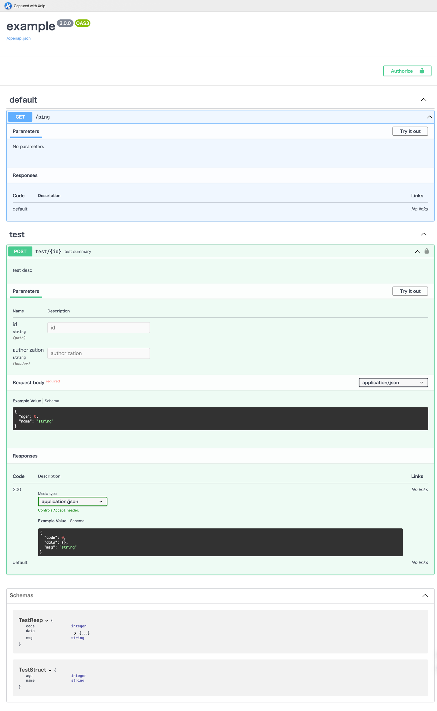

# egs
Egs is a Go framework based on Gin, designed to quickly generate Swagger documentation, which means "Easy Gin Swagger"

## Featurs
+ Fast and efficient routing with Gin
+ Automatic generation of Swagger documentation

## Why I build this project?
I once wanted to find a convenient way to generate Swagger documentation for Gin web services, and then I found this 
project [SwaGin](https://github.com/long2ice/swagin). But I found that the project has not been updated sometime and
there are some problems with the code. Such as the following:
+ panic when the response struct has pointers
+ group doesn't work when use middlewares
+ don't register components for structs which results in the Swagger JSON containing many duplicated information
+ don't support enum type
+ don't support OAuth and OIDC authentication
+ can't register request struct
+ wrong field value of apiKey authentication and don't support cookie and query api key
+ authentications have the same name which causes 

So I decided to rewrite many codes and fix the above problems.

## Installation
```shell
go get -u github.com/Yuukirn/egs
```

## Usage
1. Import the package in your Go file:
```go
import "github.com/Yuukirn/egs"
```
2. Define a struct for the request parameters:
```go
type TestStruct struct {
	ID    string `uri:"id" validate:"required" json:"id"`
	Name  string `form:"name" json:"name"`
	Age   int    `form:"age" json:"age"`
	Token string `header:"authorization" validate:"required" json:"token"`
}
```
Egs uses [validator](https://github.com/go-playground/validator) to validate the request parameters, so you need to add
validate tags to the struct fields. And egs will bind the struct for you.
3. Define the api
```go
func TestApi(c *gin.Context, req TestStruct) {
	bytes, err := json.Marshal(req)
	if err != nil {
		panic(err)
	}
	println(string(bytes))
	c.JSON(http.StatusOK, TestResp{
		Code: 200,
		Msg:  "OK",
	})
}
```
Note that the first parameter is `*gin.Context`, and the second parameter is the request struct.
4. Define the router
```go
var test = router.NewRouter(TestApi,
	router.Tags("test"),
	router.Summary("test summary"),
	router.Desc("test desc"),
	router.Req(router.Request{
		Model: &TestStruct{},
	}),
	router.Resp(router.Response{
		"200": router.ResponseItem{
			Model: &TestResp{},
		},
	}),
)
```
You can also add other metadata here.
5. Register the router
```go
testGroup := app.Group("test", egs.Handlers(testMiddleware), egs.Security(jwtAuth))
testGroup.POST("/:id", test)
```

You can find an example in the examples folder.
Run the example and enter http://127.0.0.1:8080/docs then you can see the swagger docs like this.



## TODO
- [ ] Add OAuth and OIDC authentication

## ThanksTo
+ [SwaGin](https://github.com/long2ice/swagin) Swagger + Gin = SwaGin, a web framework based on Gin and Swagger
+ [kin-openapi](https://github.com/getkin/kin-openapi), OpenAPI 3.0 implementation for Go (parsing, converting,
  validation, and more).
+ [Gin](https://github.com/gin-gonic/gin), an HTTP web framework written in Go (Golang).